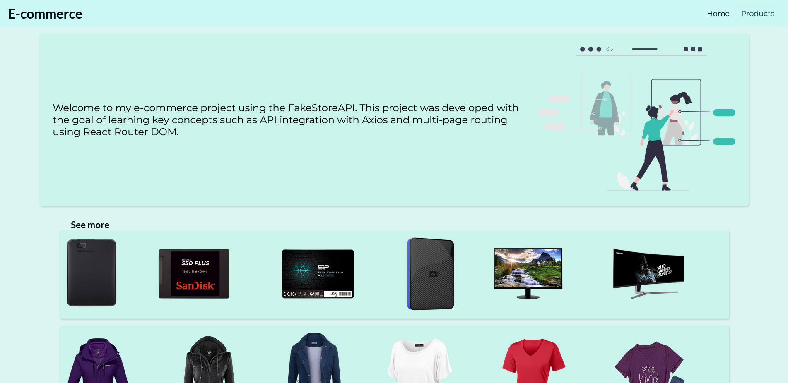

# 🛒 E-Commerce

Web application built with React that consumes the [FakeStoreAPI](https://fakestoreapi.com/), simulating an online sales store.

  
*Homepage displaying the product listing.*

---

## 🧩 Technologies Used

- **HTML5** – Semantic structure of the application  
- **CSS3** – Styling and responsiveness  
- **React** – Library for building the user interface  
  - **Axios** – API consumption using `async/await` and `Promises`  
  - **Array methods** – Data manipulation (`map`, `find`)  
  - **react-router-dom** – Page routing (`useParams`)  

---

## 🚀 Features

- Consumes the public API `https://fakestoreapi.com/products`  
- Product listing with image, title, description, and price  
- Detail page for each product  
- Feedback message when no products are found  
- Smooth navigation between pages  

---

## 📥 Installation and Running

1. Clone this repository:
   ```bash
   git clone https://github.com/your-username/e-commerce.git
